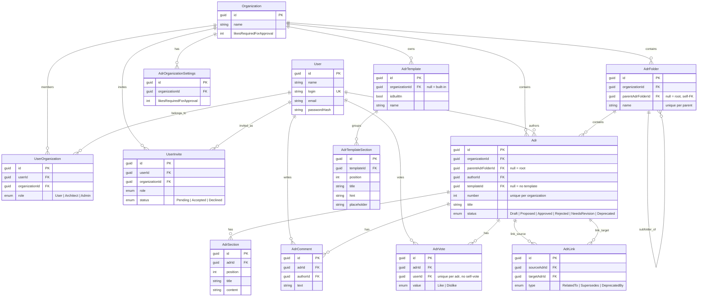

# Схема базы данных CADR

CADR использует PostgreSQL (EF Core, code-first). Все сущности мягко удаляются
(`DeletedAt`, запросы фильтруются через `NotDeletedAt()`), у всех таблиц есть
`CreatedAt` / `UpdatedAt`.

## Ключевые бизнес-правила на уровне данных
- **Автоодобрение**: когда счёт голосов Proposed-ADR достигает
  `LikesRequiredForApproval`, ADR автоматически переходит в Approved.
- **Удаление папки каскадное**: удаляются все вложенные подпапки и их ADR.
- **Обновление ADR** заменяет все секции (delete + recreate по Position).
- **Обновление папки** валидируетparent: не сам в себя, не потомок,
  та же организация.